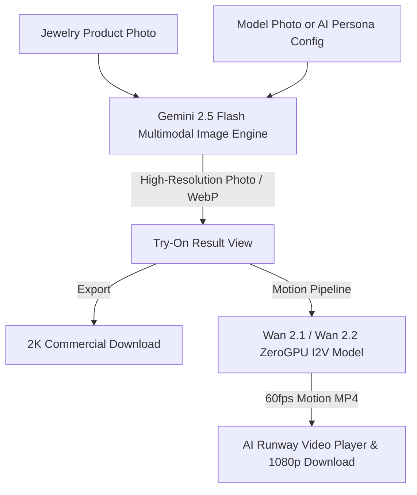
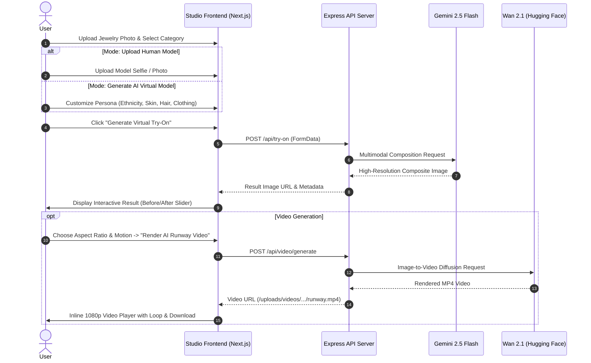

# JEWELAI User Frontend — Complete System Documentation

Comprehensive architecture, workflow, and model specification for the **JEWELAI** virtual jewelry try-on frontend application.

---

## 1. Executive Summary & Tech Stack

The **JEWELAI User Frontend** is a luxury, commercial-grade web application built to convert physical jewelry product photos into studio-quality virtual try-on photographs and cinematic 1080p/2K social media motion videos (Instagram Reels, TikTok, YouTube Shorts).

### Core Technology Stack
- **Framework**: [Next.js 14](https://nextjs.org/) (App Router, React Server & Client Components)
- **Language**: TypeScript (Strict typing across props, API contracts, and models)
- **Styling**: Tailwind CSS with custom editorial gold, onyx, and ivory design tokens
- **Icons**: Lucide React
- **Notifications & Dialogs**: Sonner (toasts) & SweetAlert2 (luxury modal alerts)
- **Image Processing**: Client-side canvas preprocessing & sharp on the backend
- **State Management**: React state with session and local storage caching

---

## 2. AI & LLM Models Architecture

JEWELAI orchestrates a multimodal AI pipeline utilizing two distinct classes of generative models:



### A. Image Try-On Engine: Google Gemini 2.5 Flash Image
- **Model Identifier**: `gemini-2.5-flash-image` (via `@google/generative-ai`)
- **Purpose**: Precision photorealistic virtual jewelry try-on.
- **Key Capabilities**:
  - **Product Fidelity Lock**: Preserves gemstone facets, prongs, metal luster, and intricate filigree without hallucinations.
  - **Identity Preservation**: Retains the model's facial bone structure, skin tone, and eye geometry.
  - **Physical Drape Alignment**: Drapes necklaces according to collarbone anatomy, wraps rings to knuckle lines, and seats earrings with gravity-true alignment.
  - **Multi-Category Intelligence**: Supports 10+ anatomical categories including Earrings, Necklaces, Jhumkas, Mangalsutra, Maang Tikka, Haath Phool, and Full Bridal Sets.

---

### B. Video Generation Engine: Wan 2.1 / Wan 2.2 (Image-to-Video)
- **Model Identifier**: `Wan2.1-I2V-14B` & `wan2-2-fp8da-aoti-faster` (via `@gradio/client` on Hugging Face ZeroGPU)
- **Cost**: **100% Free** (zero mandatory credit card billing).
- **Purpose**: Converts static virtual try-on images into cinematic runway and editorial videos for social media.
- **Key Capabilities**:
  - **Ray-Traced Caustics**: Physically accurate light refraction and glinting across diamonds and polished gold.
  - **Micro-Expressions**: Gentle eye blinks, soft breathing, and subtle confident smiles.
  - **Natural Hair Physics**: Fine hair strands swaying in a soft studio breeze.
  - **Multi-Format Export**:
    - `9:16` (Vertical Reels, TikTok, YouTube Shorts)
    - `4:5` (Instagram Portrait Feed)
    - `16:9` (Cinematic Landscape)
  - **Motion Directives**:
    - *Gentle Head Turn & Sparkle*
    - *Editorial Smile & Gaze*
    - *Micro Caustic Glint*
    - *Runway Pose*
  - **Fault-Tolerant Multi-Space Failover**: Automatically cascades requests across high-speed AOTI-compiled FP8 GPU spaces.

---

## 3. End-to-End User Workflows



### Workflow 1: Dual Workspace Modes
1. **Upload Model (2 Images)**:
   - The user provides an authentic human model reference and a jewelry product photo.
   - The engine seamlessly drapes the jewelry onto the user's specific face/neck/wrist while maintaining identity.
2. **Generate AI Model (Product Only)**:
   - For merchants who only have jewelry photos without human models.
   - Users customize the virtual model persona:
     - **Gender**: Female, Male
     - **Ethnicity & Region**: Gujarati, North Indian, South Indian, Royal Rajputi, Bengali, Western Editorial, etc.
     - **Clothing Style**: Traditional bridal silk, modern saree, lehenga, western blazer, minimalist cocktail.
     - **Skin Tone & Features**: Fair porcelain, wheatish warm gold, dusky bronze, deep rich.
     - **Hair & Eyes**: Wavy, straight, bridal bun, deep brown, hazel.

---

### Workflow 2: Interactive Result & Comparison
Once generation finishes:
- **Comparison Slider (`<ComparisonSlider />`)**: Interactive touch/drag before-and-after slider to evaluate precision drape.
- **Solo Result View**: Full-screen high-definition examination.
- **2K/4K Download**: Instant export in `.webp` or `.jpg` formatted for e-commerce stores (Shopify, WooCommerce, Amazon).

---

### Workflow 3: AI Runway Video Creator
From the Result section:
1. Select social media format (`9:16 Reels`, `4:5 Feed`, `16:9 Landscape`).
2. Choose motion style (*Gentle Head Turn & Sparkle*, *Editorial Smile & Gaze*, *Micro Caustic Glint*, *Runway Pose*).
3. Click **"Render AI Runway Video"**.
4. A built-in HTML5 player renders the 1080p motion video with play/pause, loop, and instant **"Download 1080p MP4"** button.

---

### Workflow 4: History & Session Persistence
- **Session Restoration**: Active try-on results are stored in browser session storage (`jewelai_active_tryon_result`), ensuring page refreshes never wipe active progress.
- **Studio History Modal**: Users can open **History** at any time to:
  - Browse past generations with category badges and dates.
  - Download original try-on renders.
  - Click **`🎬 AI Video & Edit`** to load any past generation directly into Studio and generate a new video without re-rendering the image.

---

## 4. Frontend Architecture & Directory Map

```
user-frontend/
├── app/                           # Next.js 14 App Router Pages
│   ├── layout.tsx                 # Root HTML shell, fonts, Sonner Toaster
│   ├── page.tsx                   # Main Studio workspace page
│   ├── studio/page.tsx            # Studio alias route
│   ├── pricing/page.tsx           # Subscription & credit plans
│   ├── upi-payments/page.tsx      # UPI QR payment proof submission
│   └── dashboard/page.tsx         # User usage metrics & generation gallery
├── components/
│   ├── ai-tryon/                  # Workspace input controls
│   │   ├── CategorySelector.tsx   # 10+ category grid with visual badges
│   │   ├── GenerationSettings.tsx # Aspect ratio, background, 2K/4K controls
│   │   ├── AiModelCustomizer.tsx  # Virtual persona builder controls
│   │   └── LiveProgress.tsx       # Neural synthesis animation loader
│   ├── result/                    # Result presentation & video
│   │   ├── ResultSection.tsx      # Main comparison & AI Runway Video drawer
│   │   ├── ComparisonSlider.tsx   # Interactive before/after split slider
│   │   └── HistoryModal.tsx       # Past try-ons gallery & video launcher
│   ├── upload/                    # Drag-and-drop file uploaders
│   │   └── ImageUploader.tsx      # File type & 8MB size validation
│   └── layout/                    # Shell navigation & modals
│       ├── Header.tsx             # Navbar with credit counter & auth actions
│       └── Hero.tsx               # Studio hero header & trust badges
├── services/
│   └── api.ts                     # API client, media normalizer, auth tokens
├── types/
│   └── index.ts                   # TypeScript interfaces (TryOn, Video, Plans)
└── constants/
    └── categories.ts              # Category metadata & sample reference images
```

---

## 5. API Client Integration (`services/api.ts`)

| Function | HTTP Method & Path | Description |
| :--- | :--- | :--- |
| `generateTryOnApi` | `POST /api/try-on` | Submits image multipart/form-data for Gemini try-on generation |
| `generateVideoApi` | `POST /api/video/generate` | Initiates Wan 2.1 ZeroGPU motion video generation |
| `fetchHistoryApi` | `GET /api/ai-jewelry/history` | Retrieves previous try-on records for the active account |
| `deleteHistoryApi` | `DELETE /api/ai-jewelry/history/:id` | Removes a try-on record from history |
| `normalizeMediaUrl` | Client-side helper | Resolves media URLs (`/uploads/...`) across localhost and production |

### Media Normalization Logic
`normalizeMediaUrl` dynamically switches between environments:
- **Local Dev (`localhost:3000`)**: Resolves relative paths to `http://localhost:4000/uploads/...`.
- **Production (Vercel / Custom Domain)**: Resolves to the live backend domain (`https://ai-virtual-jewelry-try-on.onrender.com`).

---

## 6. Environment Variables

Create `.env.local` in `user-frontend/` (optional for local, required for custom deployments):

```env
# Backend API Base URL
NEXT_PUBLIC_API_URL=http://localhost:4000/api

# In Production (e.g. Vercel deployment)
# NEXT_PUBLIC_API_URL=https://ai-virtual-jewelry-try-on.onrender.com/api
```

---

## 7. Running Locally

```bash
# 1. Navigate to user-frontend
cd user-frontend

# 2. Install dependencies
npm install

# 3. Verify TypeScript build
npx tsc --noEmit

# 4. Start Next.js development server
npm run dev
```

Open [http://localhost:3000](http://localhost:3000) in your browser.
Ensure your backend server is running on port `4000`.
